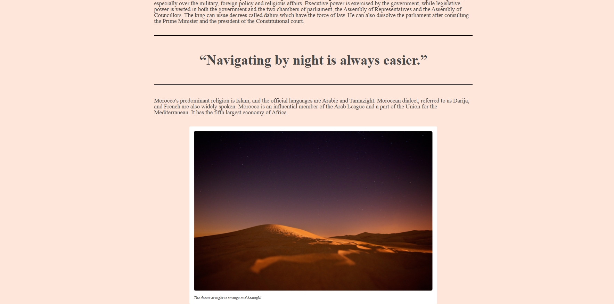

# Whereas Recognition of the Inherent Dignity

## Description
A project dedicated to recognizing and promoting the inherent dignity of every individual. This repository may include resources, documentation, and tools to support this mission.

## Features
- Clear and accessible documentation
- Modern and responsive design (see `index.html` and `style.css`)
- Custom fonts for enhanced readability
- Easy to extend and customize

## Installation
1. Clone the repository:
	```sh
	git clone https://github.com/poiut23/Whereas-recognition-of-the-inherent-dignity.git
	```
2. Open the project folder in your preferred code editor.

## Screenshots


 




## Usage
Open `index.html` in your web browser to view the project. Customize `style.css` and the `fonts/` directory as needed.

## Contributing
Contributions are welcome! Please open an issue or submit a pull request for any improvements or suggestions.

## License
This project is licensed under the MIT License. See the [LICENSE](LICENSE) file for details.

## Contact
For questions or feedback, please contact the repository owner via GitHub.
